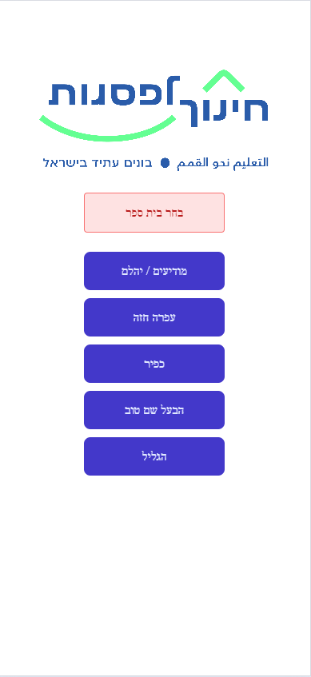
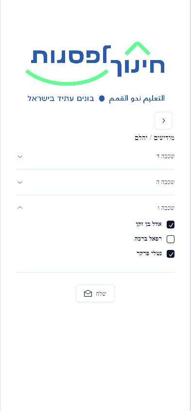
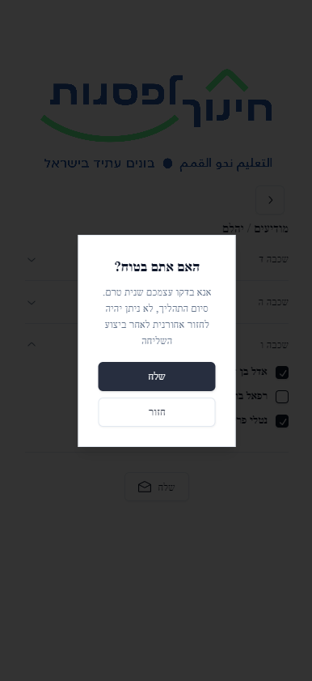

# Volunteer Presence Web App


## Overview

This project is a freelance web application designed primarily for mobile usage but also suitable for larger resolutions.
It aims to streamline the process of tracking attendance for volunteers instructing 4th to 7th graders in math and programming languages.
Volunteers can log in, mark the attendance of the children using checkboxes, and submit the attendance chart to the manager via email.

Additionally, the project implements components from "shad.cn", enhancing the user interface and experience with professionally designed elements.


## Features

- **User Authentication**: Volunteers can log in securely to access the attendance tracking functionality.
- **Attendance Tracking**: Volunteers can mark the presence of children for each session using checkboxes.
- **Email Submission**: Upon submission, the updated attendance chart is sent via email to the manager for record-keeping.
- **React Frontend**: The frontend of the application is built using React, providing a dynamic and responsive user interface.
- **Node.js Server**: The server-side logic is implemented using Node.js, providing a scalable and efficient runtime environment.
- **Integration with shad.cn Components**: The project incorporates components from "shad.cn", enhancing the user interface with professionally designed elements.
- **JSON Data Storage**: Instead of a traditional database, the application stores attendance data in JSON files and replacing them constantly with new ones, simplifying setup and maintenance.
- **Responsive Design**: The user interface is designed to be responsive, ensuring a consistent experience across different devices and screen sizes.

## Installation

1. **Clone the repository**: `git clone https://github.com/natikozel/school-project.git`
2. **Install dependencies**: `npm install`

1. Clone the repository:

```bash
git clone https://github.com/your-username/volunteer-presence-web-app.git
```

## Usage

To run the project locally, after installing dependencies, start the application by running:

```bash
npm start
```
Access the game in your browser by visiting `http://localhost:3000`.

## Screenshots

### Login


*This image showcases the login system of the app along with the organization's logo. To log in, users are required to enter the username "נתנאל קוזל".*

### School Selection UI


*This image displays the user interface where volunteers are prompted to select the school they are volunteering at.*

### Children Attendance Interface


*This image presents multiple accordions, each containing a list of checkboxes corresponding to the names of children attending the session. Volunteers can mark the attendance of each child by selecting the checkboxes.*

### Confirmation Popup


*This image showcases a popup message confirming the submission of attendance. Clicking "Send" in the popup will trigger the sending of the attendance email to the manager.*


## Contributing

Contributions are welcome! If you'd like to improve the game or add new features, feel free to submit a pull request.


## Contact

For any inquiries or feedback, feel free to contact [netanelkozel@gmail.com](mailto:netanelkozel@gmail.com).


